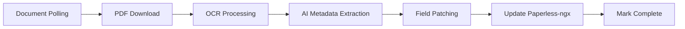

# Paperless-AI Pipeline

<div align="center">

[](https://openjdk.java.net/projects/jdk/21/)
[](https://spring.io/projects/spring-boot)
[](https://maven.apache.org/)
[](LICENSE)

*AI-powered document processing pipeline for Paperless-ngx*

[Features](#-features) • [Quick Start](#-quick-start) • [Configuration](#-configuration) • [API](#-api-reference) • [Contributing](#-contributing)

</div>

## 📋 Overview

**Paperless-AI Pipeline** is a production-ready, headless service that automatically enriches documents in [Paperless-ngx](https://github.com/paperless-ngx/paperless-ngx) using AI-powered metadata extraction. Unlike existing tools, it supports multi-step processing pipelines with configurable OCR and AI providers, all managed through declarative YAML configuration.

### Why Paperless-AI Pipeline?

- **🚀 Complete Automation**: Scheduled polling finds documents, extracts text via OCR, enriches metadata with AI, and updates Paperless-ngx
- **🔧 YAML Configuration**: Define multiple processing pipelines with different rules, providers, and outputs
- **⚡ Parallel Processing**: AI metadata extraction runs in parallel for optimal performance
- **🔒 Production Ready**: Document-level locking, comprehensive error handling, and reactive architecture
- **🎯 Extensible**: Clean provider interfaces for easy integration of additional OCR and LLM services

## ✨ Features

### Core Capabilities
- **📊 AI Metadata Extraction**: Parallel extraction of titles, tags, correspondents, custom fields, and dates
- **🔍 OCR Processing**: PDF-to-text conversion with configurable providers (OpenAI GPT-4V ready)
- **📋 Multi-Pipeline Support**: Configure different processing rules for different document types
- **🔄 Automatic Polling**: Scheduled document discovery based on tag selectors
- **⚙️ Field Patching**: Apply tags, set correspondents, and update custom fields automatically

### Technical Highlights
- **☁️ Cloud-Native**: Stateless design, Docker containerization, horizontal scaling ready
- **⚡ Reactive Architecture**: Non-blocking I/O with Spring WebFlux and Project Reactor
- **🔐 Secure**: Token-based authentication, environment variable configuration
- **🧪 Tested**: Comprehensive unit and integration tests with WireMock
- **📈 Observable**: Structured logging and error handling throughout the pipeline

## 🚀 Quick Start

### Prerequisites

- Java 21+
- Paperless-ngx instance with API access
- OpenAI API key (or compatible API endpoint)

### Run with Docker

```bash
docker run -d \
  -e PAPERLESS_BASE_URL=https://your-paperless-instance.com \
  -e PAPERLESS_TOKEN=your-api-token \
  -e OPENAI_API_KEY=your-openai-key \
  -v $(pwd)/config.yml:/app/config/application.yaml \
  erhardt-labs/paperless-ai-flow:latest
```

### Build from Source

```bash
git clone https://github.com/erhardt-labs/paperless-ai-flow.git
cd paperless-ai-flow
./mvnw clean package
java -jar app/target/paperless-ai-flow-*.jar
```

### Configuration

Create an `application.yaml` file:

```yaml
spring:
  ai:
    openai:
      api-key: ${OPENAI_API_KEY}
      chat:
        base-url: https://openrouter.ai/api  # Optional: Use OpenRouter

paperless:
  api:
    base-url: ${PAPERLESS_BASE_URL}
    token: ${PAPERLESS_TOKEN}
  pipelines:
    - name: invoices_processing
      selector:
        required-tags: ["inbox", "invoice"]
      polling:
        interval: 60s
        enabled: true
      extraction:
        title: true
        correspondent: true
        tags: true
        customFields: true
        createdDate: true
      patches:
        - action: add
          type: tag
          name: processed
        - action: drop
          type: tag
          name: inbox
```

## 📖 How It Works

### Processing Pipeline



1. **Document Discovery**: Polls Paperless-ngx for documents matching tag selectors
2. **OCR Processing**: Downloads PDFs, converts to images, extracts text using AI
3. **Metadata Extraction**: Parallel AI processing extracts structured metadata:
   - **Title**: Generates meaningful document titles
   - **Tags**: Suggests relevant tags based on content
   - **Correspondent**: Identifies senders/organizations
   - **Custom Fields**: Extracts structured data (amounts, dates, etc.)
   - **Created Date**: Finds document creation/issue dates
4. **Field Patching**: Applies pipeline-specific updates (add/drop tags, set fields)
5. **Document Update**: Saves all enriched metadata back to Paperless-ngx

### AI Models

Each extraction type uses specialized AI models with:
- **Template Method Pattern**: Consistent processing across all extraction types
- **JSON Schema Validation**: Structured, validated outputs from AI models
- **Resource-Based Prompts**: Maintainable prompt templates in `src/main/resources/prompts/`
- **Error Recovery**: Graceful degradation when AI processing fails

## 🔧 Configuration

### Pipeline Structure

```yaml
paperless:
  pipelines:
    - name: "pipeline-name"              # Unique pipeline identifier
      selector:
        required-tags: ["tag1", "tag2"] # Documents must have ALL these tags
      polling:
        interval: 30s                   # How often to poll for documents
        enabled: true                   # Enable/disable this pipeline
      ocr:
        model: "openai/gpt-4o"         # OCR model (currently OpenAI GPT-4V)
        prompt: "custom prompt..."      # Optional: Custom OCR prompt
      extraction:                       # Configure which AI extractions to perform
        title: true
        createdDate: true
        correspondent: true
        tags: true
        customFields: true
      patches:                          # Apply these changes to documents
        - action: add                   # add, drop, or set
          type: tag                     # tag, correspondent, or custom_field
          name: "processed"
          value: "optional value"       # For custom fields
      removeInboxTags: false           # Remove inbox-style tags after processing
```

### Environment Variables

| Variable | Description | Required |
|----------|-------------|----------|
| `PAPERLESS_BASE_URL` | Paperless-ngx API base URL | Yes |
| `PAPERLESS_TOKEN` | Paperless-ngx API token | Yes |
| `OPENAI_API_KEY` | OpenAI API key | Yes |

### Advanced Configuration

#### Custom Prompts

Override default prompts for specific extractions:

```yaml
extraction:
  title: true
  titlePrompt: |
    Extract a concise title for this document.
    Format: [Type] [Company] [Date]
```

#### Multiple Pipelines

Configure different processing rules for different document types:

```yaml
pipelines:
  - name: invoices
    selector:
      required-tags: ["invoice", "inbox"]
    extraction:
      correspondent: true
      customFields: true
  - name: contracts  
    selector:
      required-tags: ["contract", "inbox"]
    extraction:
      title: true
      createdDate: true
```

## 🏗️ Architecture

### Multi-Module Structure

```
paperless-ai-flow/
├── app/                           # Main application module
│   ├── ai/                        # AI extraction models
│   ├── config/                    # Configuration management
│   ├── integration/               # Spring Integration pipeline
│   ├── ocr/                       # OCR processing
│   └── service/                   # Business logic services
└── paperless-ngx-client/         # External API client module
    ├── dtos/                      # Business domain objects
    ├── entities/                  # API response entities
    ├── mappers/                   # Entity-to-DTO conversion
    └── services/                  # Reactive API services
```

### Key Components

- **DocumentPollingIntegrationConfig**: Spring Integration pipeline orchestration
- **AbstractAiModel<T>**: Template pattern for consistent AI processing
- **DocumentMetadataExtractionService**: Parallel AI metadata extraction
- **PaperlessNgxApiClient**: Reactive Paperless-ngx API client
- **PdfOcrService**: PDF-to-image conversion and OCR processing

### Technology Stack

- **Java 21**: Modern language features and performance
- **Spring Boot 3.2**: Production-ready application framework
- **Spring Integration**: Pipeline orchestration and message processing
- **Spring AI**: Integration with OpenAI and other AI providers
- **Project Reactor**: Reactive programming for non-blocking I/O
- **Apache PDFBox**: PDF processing and image conversion

## 📚 API Reference

### Health Endpoints

| Endpoint | Description |
|----------|-------------|
| `/actuator/health` | Application health status |
| `/actuator/info` | Application information |

### Configuration Properties

See [Configuration](#-configuration) section for complete YAML structure.

### Logging

Structured logging with correlation IDs for traceability:

```
2024-01-20T10:30:00.123 INFO  [pipeline:invoices] [doc:12345] Starting metadata extraction
2024-01-20T10:30:02.456 DEBUG [pipeline:invoices] [doc:12345] Title extracted: 'Invoice Amazon 2024-01-20'
2024-01-20T10:30:05.789 INFO  [pipeline:invoices] [doc:12345] Document processing completed
```

## 🧪 Development

### Build Requirements

- Java 21+
- Maven 3.9+

### Build Commands

```bash
# Build all modules
./mvnw clean compile

# Run tests
./mvnw test

# Package application
./mvnw clean package

# Run locally
./mvnw spring-boot:run -pl app
```

### Testing

Comprehensive test coverage with:
- **Unit Tests**: All AI models and service components
- **Integration Tests**: WireMock for external API testing
- **Reactive Testing**: StepVerifier for async operations

```bash
# Run all tests
./mvnw verify

# Run specific module tests
./mvnw test -pl paperless-ngx-client
./mvnw test -pl app
```

### Docker Development

```bash
# Build image
docker build -t paperless-ai-flow .

# Run with local configuration
docker run --rm \
  -v $(pwd)/config:/app/config \
  -e PAPERLESS_BASE_URL=http://localhost:8000 \
  -e PAPERLESS_TOKEN=your-token \
  -e OPENAI_API_KEY=your-key \
  paperless-ai-flow
```

## 📊 Monitoring

### Metrics

The application provides structured logging for monitoring:

- Document processing counts and durations
- AI extraction success/failure rates
- OCR processing performance
- Pipeline execution statistics

### Error Handling

Comprehensive error recovery:
- **Graceful Degradation**: Failed AI extractions don't stop processing
- **Document Locking**: Prevents concurrent processing of same document
- **Retry Logic**: Automatic retry for transient failures
- **Error Logging**: Detailed error information with correlation IDs

## 🤝 Contributing

We welcome contributions! Please see our [Contributing Guidelines](CONTRIBUTING.md) for details.

### Development Workflow

1. Fork the repository
2. Create a feature branch
3. Make your changes with tests
4. Run the test suite
5. Submit a pull request

### Code Style

- Follow existing Java conventions
- Use Lombok for reducing boilerplate
- Write comprehensive tests
- Document public APIs

## 📄 License

This project is licensed under the Apache License 2.0 - see the [LICENSE](LICENSE) file for details.

## 🙏 Acknowledgments

- [Paperless-ngx](https://github.com/paperless-ngx/paperless-ngx) for the excellent document management system
- [Spring AI](https://spring.io/projects/spring-ai) for seamless AI integration
- [OpenAI](https://openai.com/) for powerful AI models

---

<div align="center">

**[⬆ Back to Top](#paperless-ai-pipeline)**

Made with ❤️ by [Erhardt Labs](https://github.com/erhardt-labs)

</div>
